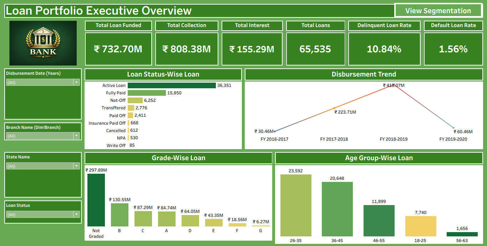

# Loan Portfolio Analytics Dashboard

This project presents an interactive loan portfolio analytics dashboard built using **Tableau**. The dashboard provides insights into loan disbursement, repayment performance, borrower segmentation, and portfolio risk indicators.

The objective of this project is to demonstrate how business intelligence tools can be used to analyze financial datasets and support **data-driven decision making in banking and lending institutions**.

---

## Project Overview

Financial institutions manage large volumes of loan data. This project analyzes loan performance across multiple dimensions such as branch, state, product category, and borrower demographics.

The dashboard focuses on three key analytical areas:

- Portfolio Performance
- Risk Monitoring
- Customer & Product Segmentation

The analysis is presented across **two interactive dashboards** to provide both high-level executive insights and deeper operational analysis.

---

## Dashboard Pages

### 1. Portfolio Executive Overview

This dashboard provides a high-level summary of the overall loan portfolio performance.

**Key KPIs**

- Total Loan Amount Funded  
- Total Loans Issued  
- Total Collection  
- Total Interest Revenue  
- Delinquent Loan Rate  
- Default Loan Rate  

**Visualizations**

- Loan Status Distribution  
- Loan Disbursement Trend  
- Credit Grade-wise Loan Distribution  
- Age Group-wise Loan Distribution  

This page is designed for **executive-level monitoring of portfolio health and growth**.

---

### 2. Segmentation & Performance Analysis

This dashboard focuses on identifying **where the business is coming from and where potential risks exist**.

**Visualizations**

- Branch-wise Performance (Revenue Analysis)
- State-wise Loan Distribution
- Religion-wise Loan Distribution
- Product Group-wise Loan Distribution

**Additional Risk Indicators**

- Default Loan Count
- Delinquent Client Count
- Unverified Loan Count

This page helps identify **growth opportunities and potential risk concentrations across segments**.

---

## Key KPIs Implemented

The project analyzes several important banking metrics:

- Total Loan Amount Funded
- Total Loans
- Total Collection
- Total Interest Revenue
- Default Loan Count
- Delinquent Client Count
- Delinquent Loan Rate
- Default Loan Rate
- Loan Status Distribution
- Branch-wise Revenue Performance
- Product Category Loan Distribution
- Borrower Demographic Segmentation

These KPIs provide a **complete view of loan performance and portfolio risk exposure**.

---

## Data Model

The dataset follows a **Star Schema Data Model**.

**Fact Table**

- Fact_Loan

**Dimension Tables**

- Dim_Client
- Dim_Branch
- Dim_State

Relationships are created using **primary and foreign keys** to ensure accurate aggregation and filtering across the dashboard.

---

## Tools & Technologies

- Tableau (Data Visualization)
- Excel / CSV (Data Preparation)
- SQL (Data Validation)
- GitHub (Project Version Control)

---

## Key Business Insights

The dashboard helps answer important business questions such as:

- Which branches generate the highest loan revenue?
- Which regions have the largest loan volumes?
- What percentage of loans are delinquent or defaulted?
- How are loans distributed across product categories?
- Which borrower segments carry higher credit risk?

---

## Dashboard Preview

### Portfolio Overview

### Segmentation & Performance Analysis

---

## Project Structure
